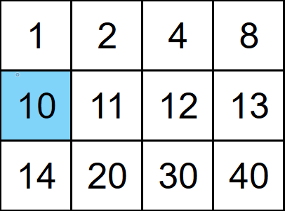

## Problem
You are given an `m x n` 2-D integer array `matrix` and an integer `target`.

- Each row in `matrix` is sorted in _non-decreasing_ order.
- The first integer of every row is greater than the last integer of the previous row.

Return `true` if `target` exists within `matrix` or `false` otherwise.

Can you write a solution that runs in `O(log(m * n))` time?

## Example


```python
Input: matrix = [[1,2,4,8],[10,11,12,13],[14,20,30,40]], target = 10

Output: true
```

## Solution
```python
class Solution:
    def searchMatrix(self, matrix: List[List[int]], target: int) -> bool:
        def binary(row: int, target: int, front: int, back: int) -> bool:
            if front <= back:
                mid = (front + back) // 2
                if target == matrix[row][mid]:
                    return True
                if target > matrix[row][back]:
                    if row == len(matrix) - 1:
                        return False
                    return binary(row + 1, target, 0, len(matrix[row + 1]) - 1)
                if target > matrix[row][mid]:
                    return binary(row, target, mid + 1, back)
                else:
                    return binary(row, target, front, mid - 1)
            return False
        
        return binary(0, target, 0, len(matrix[0]) - 1)
        
```

We can compute a binary search using a recursive algorithm but this time, we can also pass in the current row into the binary method.

This way, when the target is greater than the last element in the current row, we can then search the next row (if there are more rows) and perform a normal binary search on it.

We can then return the appropriate Boolean as the output.