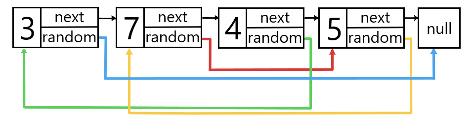

## Problem
You are given the head of a linked list of length `n`. Unlike a singly linked list, each node contains an additional pointer `random`, which may point to any node in the list, or `null`.

Create a **deep copy** of the list.

The deep copy should consist of exactly `n` **new** nodes, each including:

- The original value `val` of the copied node
- A `next` pointer to the new node corresponding to the `next` pointer of the original node
- A `random` pointer to the new node corresponding to the `random` pointer of the original node

**Note:** None of the pointers in the new list should point to nodes in the original list.

_Return the head of the copied linked list._

In the examples, the linked list is represented as a list of `n` nodes. Each node is represented as a pair of `[val, random_index]` where `random_index` is the index of the node (0-indexed) that the `random` pointer points to, or `null` if it does not point to any node.

## Example


```python
Input: head = [[3,null],[7,3],[4,0],[5,1]]

Output: [[3,null],[7,3],[4,0],[5,1]]
```
## Solution
```python

class Node:
    def __init__(self, x: int, next: 'Node' = None, random: 'Node' = None):
        self.val = int(x)
        self.next = next
        self.random = random

class Solution:
    def copyRandomList(self, head: 'Optional[Node]') -> 'Optional[Node]':
        node_map = {}
        new_map = {}

        index = 0
        curr = head
        while curr != None:
            node_map[curr] = index
            new_map[index] = Node(curr.val)
            curr = curr.next
            index += 1
        
        index = 0
        for key, value in node_map.items():
            n = key.next
            if n == None:
                new_map[index].next = None
            else:
                new_map[index].next = new_map[node_map[n]]

            r = key.random
            if r == None:
                new_map[index].random = None
            else:
                new_map[index].random = new_map[node_map[r]]

            index += 1
        
        return new_map[0] if len(new_map) else None
```

Explain: