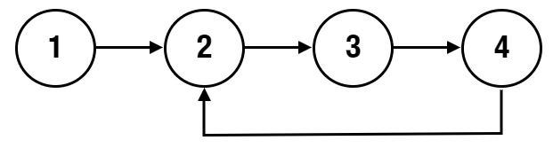

## Problem
Given the beginning of a linked list `head`, return `true` if there is a cycle in the linked list. Otherwise, return `false`.

There is a cycle in a linked list if at least one node in the list can be visited again by following the `next` pointer.

Internally, `index` determines the index of the beginning of the cycle, if it exists. The tail node of the list will set it's `next` pointer to the `index-th` node. If `index = -1`, then the tail node points to `null` and no cycle exists.

**Note:** `index` is **not** given to you as a parameter.

## Example


```python
Input: head = [1,2,3,4], index = 1

Output: true
```

## Solution
```python
# Definition for singly-linked list.
# class ListNode:
#     def __init__(self, val=0, next=None):
#         self.val = val
#         self.next = next

class Solution:
    def hasCycle(self, head: Optional[ListNode]) -> bool:
        p1 = head
        p2 = head
        while p1 != None and p2 != None:
            if not p1.next:
                return False
            p1 = p1.next.next
            if not p1:
                return False
            if p1.next == p2:
                return True
            p2 = p2.next
        return False
```

We can setup two pointers that initially point to the head of the linked list.

We can loop through the linked list as long as both pointers do not point to `None`.

While looping, if pointer 1's next value points to `None` then we can return false as no cycle can occur.
We then set pointer 1 to point to the value of the next value of its next value (so p1 = p1.next.next).

If this new node does not exist (so p1 = None), then we can also return false as no cycle can occur either.

Now, if pointer 1's node's next value points to pointer 2, then even though pointer 1 has traversed further than pointer 2 at this point, it somehow points to it. This is only possible if a cycle