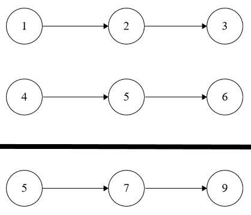

## Problem
You are given two **non-empty** linked lists, `l1` and `l2`, where each represents a non-negative integer.

The digits are stored in **reverse order**, e.g. the number 321 is represented as `1 -> 2 -> 3 ->` in the linked list.

Each of the nodes contains a single digit. You may assume the two numbers do not contain any leading zero, except the number `0` itself.

Return the sum of the two numbers as a linked list.

## Example


```python
Input: l1 = [1,2,3], l2 = [4,5,6]

Output: [5,7,9]

Explanation: 321 + 654 = 975.
```
## Solution
```python
# Definition for singly-linked list.
# class ListNode:
#     def __init__(self, val=0, next=None):
#         self.val = val
#         self.next = next

class Solution:
    def addTwoNumbers(self, l1: Optional[ListNode], l2: Optional[ListNode]) -> Optional[ListNode]:
        def add(l1, l2, carry, res):
            if l1 and l2:
                digit = l1.val + l2.val + carry

                res.val = digit % 10
                res.next = add(l1.next, l2.next, digit // 10, ListNode())
            elif l1 and not l2:
                digit = l1.val + carry
                res.val = digit % 10
                res.next = add(l1.next, None, digit // 10, ListNode())
            elif not l1 and l2:
                digit = l2.val + carry
                res.val = digit % 10
                res.next = add(None, l2.next, digit // 10, ListNode())
            else:
                if carry == 0:
                    return None
                else:
                    return ListNode(carry)
            
            return res

        
        return add(l1, l2, 0, ListNode())
```

We can use a recursive algorithm to solve this problem.

Firstly, we need to pass in the linked list pointers as well as a carry value and a result node.

Within our recursive algorithm, we need to check if both linked list pointers point to a node. If they do, then we can perform our addition formula.

The digit is equal to the summation of the two linked list pointers plus the carry value.

The actual result value (the number saved as the result nodes' value) is equal to the remainder of dividing the digit by 10.

The new carry value (the number used in the next place value's addition) is equal to the integer result of dividing the digit by 10.

We can then set the next value of the result node to be the returned value of calling our recursive algorithm with the next value nodes of both linked list pointers, the calculated carry value, and a new empty node.

---

Now, if only one of the linked list pointers point to a node while the other does not, then we can just use the value of the node that exists (the other pointer will point to `None`) and add the carry value to it.

The calculation of the result value and new carry value is the same as our addition formula.

However, we set the resulting node's next value to point to the returned value of calling our recursive algorithm with the next value node of one linked list pointer (the one the exits), None (the pointer that points to `None`), the calculated carry value, and a new empty node.

---

If both linked list pointers point to `None`, then we can check one condition.

If the passed in carry value is equal to 0 then we just return `None`. However, if it is not, then we can return a new node that has the value of the passed in carry value.

Finally, we can return the originally resulting node.