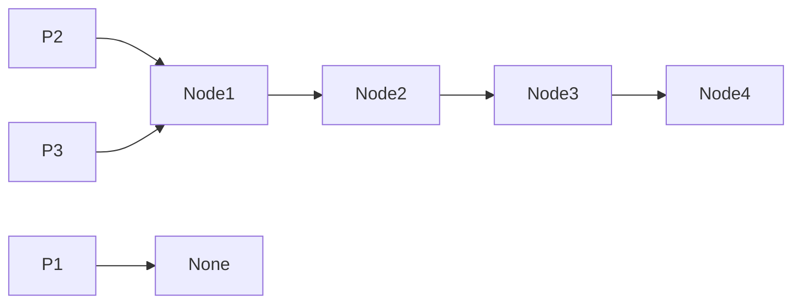
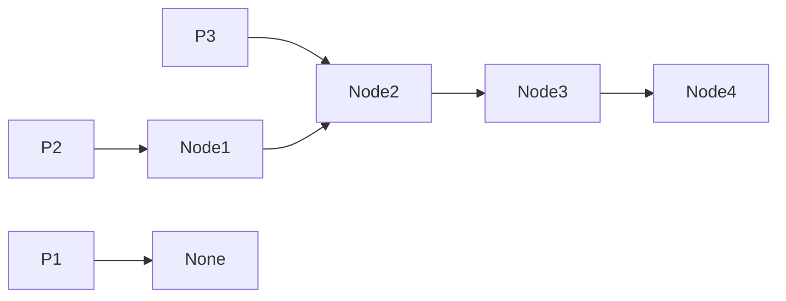
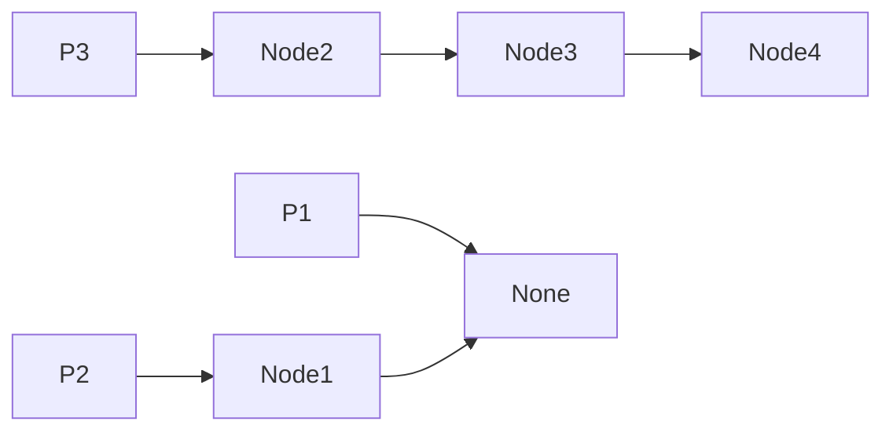
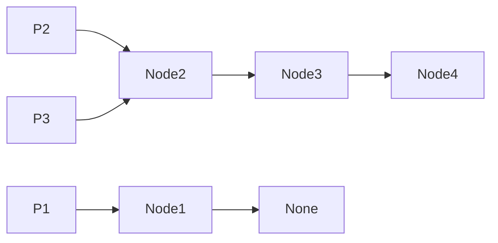
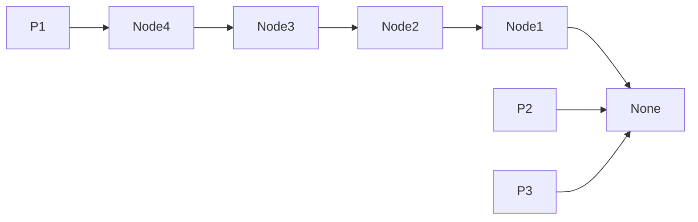

## Problem
Given the beginning of a singly linked list `head`, reverse the list, and return the new beginning of the list.

## Example
```python
Input: head = [0,1,2,3]

Output: [3,2,1,0]
```

## Solution
```python
# Definition for singly-linked list.
# class ListNode:
#     def __init__(self, val=0, next=None):
#         self.val = val
#         self.next = next

class Solution:
    def reverseList(self, head: Optional[ListNode]) -> Optional[ListNode]:
        p1, p2, p3 = None, head, head
        while p3 != None:
            p3 = p3.next
            p2.next = p1
            p1 = p2
            p2 = p3
        return p1
```

Using 3 pointers, we can do this in `O(n)` where `n` is the number of nodes in the given linked list. 

First, we need pointer 1 to point to the node on the left of pointer 2, we need pointer 2 to point to the current node whose next value is being flipped, and lastly, we need pointer 3 to point to the next node that will get its next value flipped.



We can then traverse the linked list until pointer 3 points to `None` which means we have reached the end of the linked list.

Inside the while loop, we can first increment pointer 3 so we can get the next node ready.



We can then flip the next value of the node at pointer 2 point to the value of pointer 1.



We then set pointer 1 to point to the node at pointer 2 and set pointer 2 to point to the node at pointer 3.



After we have continued this for the entire linked list, we then return the node at pointer 1 as it will be the new head of the linked list.

