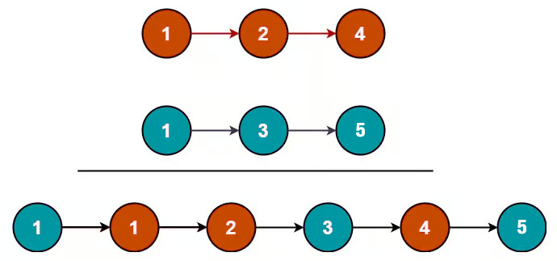

## Problem
You are given the heads of two sorted linked lists `list1` and `list2`.

Merge the two lists into one **sorted** linked list and return the head of the new sorted linked list.

The new list should be made up of nodes from `list1` and `list2`.

## Example


```python
Input: list1 = [1,2,4], list2 = [1,3,5]

Output: [1,1,2,3,4,5]
```

## Solution
```python
# Definition for singly-linked list.
# class ListNode:
#     def __init__(self, val=0, next=None):
#         self.val = val
#         self.next = next

class Solution:
    def mergeTwoLists(self, list1: Optional[ListNode], list2: Optional[ListNode]) -> Optional[ListNode]:
        if list1 and list2:
            if list1.val <= list2.val:
                list1.next = self.mergeTwoLists(list1.next, list2)
                return list1
            else:
                list2.next = self.mergeTwoLists(list1, list2.next)
                return list2
        elif list1 and not list2:
            return list1
        elif not list1 and list2:
            return list2
        else:
            return None

        return self.mergeTwoLists(list1, list2)
```

We can traverse both linked lists and compare the value of the each node in an orderly fashion.

Using a recursive algorithm, we can pass both linked lists pointers (which originally point )