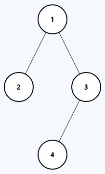

## Problem
Given a binary tree, return `true` if it is **height-balanced** and `false` otherwise.

A **height-balanced** binary tree is defined as a binary tree in which the left and right subtrees of every node differ in height by no more than 1.

## Example


```python
Input: root = [1,2,3,null,null,4]

Output: true
```

## Solution
```python
# Definition for a binary tree node.
# class TreeNode:
#     def __init__(self, val=0, left=None, right=None):
#         self.val = val
#         self.left = left
#         self.right = right

class Solution:
    def isBalanced(self, root: Optional[TreeNode]) -> bool:
        def dfs(root):
            if root:
                left = dfs(root.left)
                right = dfs(root.right)
                
                if abs(left - right) <= 1:
                    return max(left, right) + 1
                else:
                    return 10000
            return 0
        
        return True if dfs(root) < 10000 else False
        
```

Explain: 