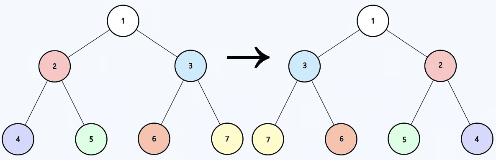

## Problem
You are given the root of a binary tree `root`. Invert the binary tree and return its root.

## Example


```python
Input: root = [1,2,3,4,5,6,7]

Output: [1,3,2,7,6,5,4]
```

## Solution
```python
# Definition for a binary tree node.
# class TreeNode:
#     def __init__(self, val=0, left=None, right=None):
#         self.val = val
#         self.left = left
#         self.right = right

class Solution:
    def invertTree(self, root: Optional[TreeNode]) -> Optional[TreeNode]:
        if root:
            root.left, root.right = root.right, root.left
            self.invertTree(root.left)
            self.invertTree(root.right)
            return root
```

Explain: