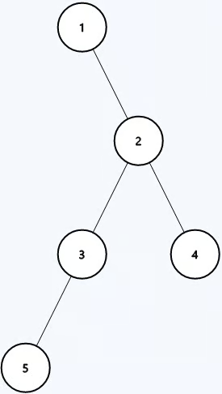

## Problem
The **diameter** of a binary tree is defined as the **length** of the longest path between _any two nodes within the tree_. The path does not necessarily have to pass through the root.

The **length** of a path between two nodes in a binary tree is the number of edges between the nodes. Note that the path can _not_ include the same node twice.

Given the root of a binary tree `root`, return the **diameter** of the tree.

## Example


```python
Input: root = [1,null,2,3,4,5]

Output: 3
```

## Solution
```python
# Definition for a binary tree node.
# class TreeNode:
#     def __init__(self, val=0, left=None, right=None):
#         self.val = val
#         self.left = left
#         self.right = right

class Solution:
    dia = 0
    def diameterOfBinaryTree(self, root: Optional[TreeNode]) -> int:
        def get_dia(root) -> int:
            if root:
                left = get_dia(root.left)
                right = get_dia(root.right)
                sub_dia = left + right
                self.dia = max(self.dia, sub_dia)
                return max(left, right) + 1
            return 0
        
        get_dia(root)
        return self.dia

```

Explain: