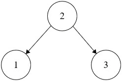

## Problem
Given the `root` of a binary tree, return `true` if it is a **valid binary search tree**, otherwise return `false`.

A **valid binary search tree** satisfies the following constraints:

- The left subtree of every node contains only nodes with keys **less than** the node's key.
- The right subtree of every node contains only nodes with keys **greater than** the node's key.
- Both the left and right subtrees are also binary search trees.

## Example


```java
Input: root = [2,1,3]

Output: true
```
## Solution
```python
# Definition for a binary tree node.
# class TreeNode:
#     def __init__(self, val=0, left=None, right=None):
#         self.val = val
#         self.left = left
#         self.right = right

class Solution:
    def isValidBST(self, root: Optional[TreeNode]) -> bool:
        def checkTree(root, s, l):
            if root:
                if not (root.val > s and root.val < l): return False

                left = checkTree(root.left, s, root.val)
                if left:
                    return checkTree(root.right, root.val, l)
                return False
            return True
        
        return checkTree(root, -10000000000, 10000000000)

```

Explain: 